# ONE-PIX measure 

This repository houses measurement samples collected using the ONE-PIX kit. It features a variety of unconventional imaging techniques employed to build this comprehensive database. Each dataset can be easily loaded using the functions provided in the ONE-PIX repository.

## Content 

Each ONE-PIX measurement contained in this repository is listed in the table below:

### Classical HSPI folder 

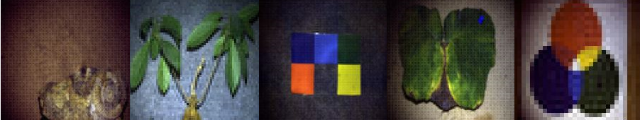

|Measure name|Scene description|Use case |Spatial resolution (pix²)|Pattern basis|RGB rendering|
|---|---|---|---|---|---|
|Ammonite_fossil|Hypercube of an ammonite fossil|Paleontology|101x101|Fourier split|
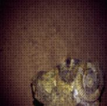
|
|Bonzai_NIR|Hypercube of a bonsai acquired over a widened spectral range allowing the red edge to be seen|Life science|61x61|Fourier split|
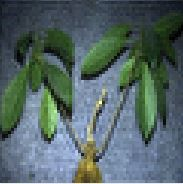
|
|Color_addition|Hypercube of a sheet of A4 paper with a print of the additive synthesis rosette.|Colorimetry,hyperspectral segmentation|31x31|Fourier split|
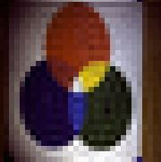
|
|Colored_squares|Hypercube of colored squares printed on paper glued to a gray carpet|Colorimetry,Hyperspectral segmentation|101x101|Fourier split|
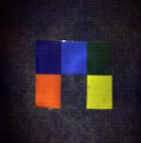
|
|Squash_leaf|Squash leaf maintained with green and blue bugs having areas of necrosis and chlorosis.|Life science agronomy|101x101|Fourier split|
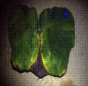
|

### HAS measure 

|Measure name|Scene description|Use case |Segmentation method|Clusters from RGB|
|---|---|---|---|---|
|Chlorophytum_comosum| HAS measure of a spider plant (Chlorophytum_comosum)|Life science agronomy|Kmeans segmentation|
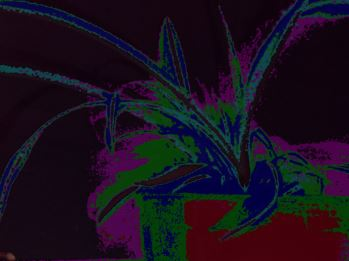
|
|Nicotiana_tabacum| HAS measure of a tobacco plant (Nicotiana_tabacum) with a upper view and a sgementation of each leaves|Life science agronomy|Manual segmentation|
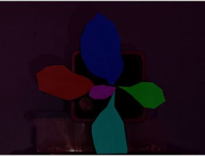
|
|The Black Island| HAS measure of book cover of the famous Black Island adventure of Tintin by Hergé. |Color analysis art analysis|Kmeans segmentation|
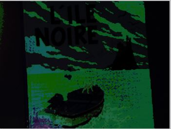
|
|PMS sight| HAS measurement of a red colored square target with changing PMS values |Color analysis art analysis|Labeleme segmentation|
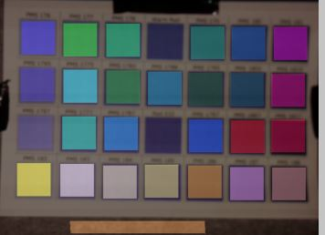
|

### Spyrit :

|Measure name|Scene description|Use case |Spatial resolution (pix²)|Pattern basis|RGB rendering|
|---|---|---|---|---|---|
|Colored_squares (linear_reconstruction)|Hypercube of colored squares printed on paper glued to a gray carpet with linear reconstruction|Colorimetry,Hyperspectral segmentation|32x32|Walsh Hadamard split|
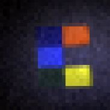
|
|Colored_squares (spyrit_reconstruction)|Same measure than linear reconstruction but with CNN reconstruction|deeplearning|64x64|Walsh Hadamard split acquisition and CNN reconstruction|

|

